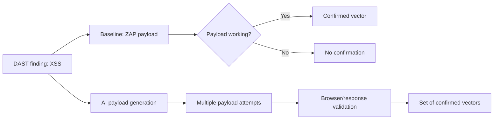

# Анализ эмпирического материала (Data Analysis)

## 1. Гипотеза исследования

**H1 (альтернативная гипотеза):**  
Внедрение ИИ-движка статистически значимо улучшает качество подтверждения уязвимостей и снижает трудозатраты аналитика.

**H0 (нулевая гипотеза):**  
Внедрение ИИ-движка не приводит к статистически значимому улучшению качества подтверждения уязвимостей и снижению трудозатрат аналитика.

---

## 2. Цель эмпирического анализа

Проверить, дает ли ИИ-этап эксплуатации практическое преимущество относительно базового DAST-подхода при подтверждении XSS-уязвимостей.

---

## 3. Дизайн сравнения

Сравнивались два режима:

- **Baseline (DAST-only):** OWASP ZAP без ИИ-генерации payload'ов.
- **AI-assisted:** DAST + ИИ-генерация и подбор payload'ов с последующей проверкой срабатывания.

Единица сравнения: одна уязвимая точка (`URL + параметр`), для которой фиксируется количество реально сработавших payload.

---

## 4. Набор эмпирических наблюдений

### 4.1 Тестовые цели

1. `http://192.168.56.101/WebGoat/attack`  
2. `http://192.168.56.101/dvwa/vulnerabilities/xss_r/`  
3. `http://localhost:9999/xss_r`

### 4.2 Наблюдаемые результаты по кейсам

- Для `WebGoat/attack`: XSS обнаружен, ZAP рабочий payload не предоставил, ИИ нашел 3 рабочих payload.
- Для `dvwa/vulnerabilities/xss_r/`: XSS обнаружен, ZAP рабочие payload не предоставил, ИИ нашел 2 рабочих payload.
- Для `localhost:9999/xss_r`: ZAP вернул неработающий script payload, ИИ нашел 3 рабочих payload.

---

## 5. Таблица сравнительных результатов

| № | Целевая страница | Тип уязвимости | Рабочие payload (Baseline, ZAP) | Рабочие payload (AI) | Прирост (AI - Baseline) |
|---|---|---|---:|---:|---:|
| 1 | `http://192.168.56.101/WebGoat/attack` | XSS | 0 | 3 | +3 |
| 2 | `http://192.168.56.101/dvwa/vulnerabilities/xss_r/` | XSS | 0 | 2 | +2 |
| 3 | `http://localhost:9999/xss_r` | XSS | 0 *(предложен нерабочий payload)* | 3 | +3 |

---

## 6. Агрегированная статистика

- Количество тестовых точек: **3**
- Суммарно рабочих payload в Baseline: **0**
- Суммарно рабочих payload в AI-режиме: **8**
- Абсолютный прирост рабочих payload: **+8**
- Среднее число рабочих payload на одну точку:
  - Baseline: **0.00**
  - AI-режим: **2.67**
- Доля точек, где AI дал хотя бы 1 рабочий payload: **100% (3/3)**

---

## 7. Интерпретация результатов

Полученные данные демонстрируют, что ИИ-подход расширяет пространство эксплуатационных векторов в рамках одной и той же XSS-точки. В исследованных примерах базовый DAST-подход не предоставил ни одного рабочего payload, тогда как ИИ-движок обеспечил множественные успешные варианты эксплуатации.

Практический вывод: ИИ-этап подтверждения уязвимостей повышает вероятность получения эксплуатационного PoC и снижает риск остановки анализа на "обнаружено, но не подтверждено".

---

## 8. Ограничения текущей выборки

- Небольшой объем выборки (`n=3`) ограничивает строгое статистическое обобщение.
- Все кейсы относятся к XSS; для полноты необходимы SQLi/SSRF/IDOR и другие классы.
- Требуется расширение на большее число приложений и повторных прогонов.

---

## 9. План усиления доказательной базы

Для статистически устойчивого подтверждения H1 рекомендуется:

1. Увеличить выборку до 20+ уязвимых точек.
2. Использовать парный дизайн (одни и те же точки для Baseline и AI).
3. Добавить метрики:
   - `time_to_confirm` (время подтверждения),
   - `false_positive_rate`,
   - `technique_diversity_index` (разнообразие техник payload).
4. Применить статистический тест (например, Wilcoxon signed-rank) для парных наблюдений.

---

## 10. Диаграммы для визуализации

### 10.1 Архитектурная схема анализа

### 10.2 Сравнение количества рабочих payload

```mermaid
xychart-beta
    title "Рабочие payload: Baseline vs AI"
    x-axis ["WebGoat/attack", "DVWA/xss_r", "localhost:9999/xss_r"]
    y-axis "Количество рабочих payload" 0 --> 4
    bar "Baseline (ZAP)" [0, 0, 0]
    bar "AI Engine" [3, 2, 3]
```

---

## 11. Промежуточный вывод по эмпирике

Даже на ограниченной выборке зафиксирован выраженный прирост по ключевому прикладному показателю — числу рабочих payload для подтверждения эксплуатации. Это согласуется с H1 и обосновывает дальнейшее расширение эксперимента для получения статистически устойчивого вывода.

