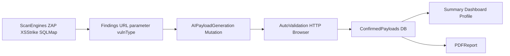

# AWAST Diploma — Presentation Structure (6 Slides)

## Slide 1 — Title Slide

**Topic:** Automated Web Application Security Testing (AWAST) by PTES Methodology  
**Full Name, Group, Department**  
**Supervisor**  
**Year / University**

**Short speaking note (10–15 sec):**  
The goal of this thesis is to design and validate an approach for automated web vulnerability confirmation using AI at the Exploitation/Post-Exploitation stages.

---

## Slide 2 — Research Method Description & Empirical Data Analysis

### Research method

- Comparative experiment: `Baseline (DAST-only)` vs `AI-assisted`.
- Methodological basis: PTES logic (focus on Exploitation/Post-Exploitation).
- Unit of analysis: one vulnerable point (`URL + parameter + type`).

### Hypothesis

- **H1:** Integrating an AI engine statistically significantly improves vulnerability confirmation quality and reduces analyst workload.
- **H0:** there is no statistically significant improvement.

### Empirical material (case sample)

- `WebGoat/attack` — XSS: Baseline 0, AI 3.
- `DVWA/xss_r` — XSS: Baseline 0, AI 2.
- `localhost:9999/xss_r` — XSS: Baseline 0 (non-working payload), AI 3.

---

## Slide 3 — Research Results & Interpretation

### Data summary

- Total working payloads: **Baseline = 0**, **AI = 8**.
- Increase: **+8** working payloads.
- Mean per vulnerable point: **0.00 -> 2.67**.
- AI produced at least one working payload in **100% of cases** (3/3).

### Interpretation

- AI expands the exploitable attack-vector space.
- It reduces the risk of a “found but not confirmed” vulnerability state.
- The approach is especially useful when template-based DAST payloads fail.

### Limitation

- The current sample size is small (`n=3`), so broader data is required for strict statistical conclusions.

---

## Slide 4 — Research Tool Presentation and Description

### Tool: AWAST (research framework)

- Backend: `FastAPI`, `SQLAlchemy Async`.
- DAST engines: `OWASP ZAP`, `XSStrike`, `SQLMap`.
- AI module: `LLMService` (payload generation/mutation).
- Exploitation confirmation: headless browser validation.
- Reporting: PDF generation and result storage.

### Tool value

- Automates the path: finding -> exploit confirmation.
- Supports reproducible experiments and comparative analysis.

---

## Slide 5 — Project Prototype

### What to show on the slide

- Screenshot of the scanning dashboard.
- Screenshot of successful XSS triggering (`confirm/alert` dialog).
- A short table fragment: “Baseline vs AI”.

### What to say

- The prototype launches a scan, receives findings, generates multiple payloads, validates execution, and stores confirmed results.
- The same endpoint can be exploited by multiple working payloads, not just one template.

---

## Slide 6 — Project Implementation and Methodology

### Project pipeline (for the slide diagram)

1. **Target scanning:** `OWASP ZAP` (+ `XSStrike` / `SQLMap` for deeper class-specific checks).
2. **Finding collection:** extract `URL + parameter + vuln_type` from scan output.
3. **AI Exploitation:** generate and mutate payload sets for the specific context.
4. **Automated validation:** send payloads and verify execution (HTTP indicators + browser check).
5. **Confirmation:** store only working exploit vectors in the database.
6. **Analytics and reporting:** summary for dashboard/profile + PDF export.

### Evaluation methodology

- Metrics: `N_working_payloads`, `SuccessRate`, `Time-to-confirm`.
- Design: paired comparison of Baseline vs AI on identical targets.
- Next step: expand the sample (20+ points), apply a statistical test (Wilcoxon).

### Final conclusion

- The approach shows practical effectiveness and strong scaling potential.

---

## Additional notes (for Q&A)

- Why this is novel: not just detection, but automated exploitation confirmation with multiple independent payloads.
- Why this matters: it reduces manual analyst effort and increases the practical value of scan results.

